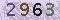
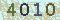
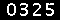
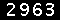

#识别简单 验证码

##copy from `www.sccredit.com`

制作很简单，改变get_image,chg_image,div_image 即可

### 这是目前最标准的一个了

##  原理
使用 PIL 来读取图像数据，numpy做相关计算。

先通过二值化，分割，贴标签标注等得到训练数据:`dataSet`，再同样操作待识别图片，将分割的一小块矩阵`_mat`对齐后与`dataSet`进行运算，使用`欧式平方距离`得到一个相关性的计算结果，给出相关性最大的一个标签及其相关性大小。

##  操作流程

### 1.下载图片
   使用`download.py`下载原始图片，默认目录是 `./raw_image` 。
   
   不同网站可以相应地修改特质的`get_image.py` 
   
   文件名格式是 N.jpg N 是编号
   
   `download.py` 参数 `-c --count` 是下载图片的数量。
   
   原始图片:
   
   
   
   
   
   
 
### 2.二值化
  使用`binary.py`将`./raw_image` 目录的原始图片经过`chg_image.py`中相应的函数转化成二值的bmp图像，二值图像的存储目录默认是`./bin_image`。
  
  其中 `chg_image.py` 中的 `chg_img`函数最为关键，必要时可以写的更复杂一些。当然这里二值化也不必要求那么高，尽善尽美就是了。
  
  文件名格式是 N.jpg.bmp  
  
  样例图片：
   
   
	
	
	

### 3.分割
  使用`split.py`将上一步二值化好的图片分割开来，具体函数参考`div_image.py` 中的 `split_mat`，以及更细的`utils.py` 中的`split_list`,`merge_list` 
  
  分割的原理大致是计算 在列方向时的累积像素值，然后进行`0`值分割(`split_list`)
  
  分割后的图像大致如下：
  
  
  
  
  
  
  文件名格式如下：
 
```
1000.jpg.bmp.0.4px16px6px13.bmp
1000.jpg.bmp.1.4px16px20px26.bmp
1000.jpg.bmp.2.4px16px32px40.bmp
1000.jpg.bmp.3.4px16px45px52.bmp
1001.jpg.bmp.0.4px16px6px14.bmp
1001.jpg.bmp.1.4px16px19px27.bmp
1001.jpg.bmp.2.4px16px32px40.bmp
1001.jpg.bmp.3.4px16px46px52.bmp
1002.jpg.bmp.0.4px16px6px13.bmp
1002.jpg.bmp.1.4px16px19px27.bmp

```

其中 `1000.jpg.bmp` 是二值化图像的名称，`0` 表示是第`0`个分割块，`4px16px6px13` 表明分割坐标是`(r1,r2,c1,c2)`，高度从 `r1`到`r2`，宽度从`c1`到`c2`。

### 4.标注

使用`rename.py`  将`./split_image` 中分割好的图片，进行标注用户可指定 验证码覆盖字符和数量

部分参数如下：

`'-c','--chars',choices=['digit','alpha','alnum']` 指定字符范围 有3种,不够可以修改最下面的 `chars`

`'--count',default=3,type=int,`  指定每个字符的样本个数，默认3张

`--withoutO` 删掉易混淆的 `0` 和 `O`

`--withoutL` 删掉易混淆的`1` 和`l`

`--upper` 奇葩的大小区分

标注时 需要输入相应字符，不知道或者换下一个 直接 按`Enter`键就行了。

 标注的图像默认存储到 `./train_image`中，
 文件格式为
 
 
```
1000.jpg.bmp.0.4px16px6px13.bmp.2.4.52.bmp
1000.jpg.bmp.1.4px16px20px26.bmp.2.5.53.bmp
1000.jpg.bmp.2.4px16px32px40.bmp.2.8.56.bmp
1000.jpg.bmp.3.4px16px45px52.bmp.2.3.51.bmp
1001.jpg.bmp.0.4px16px6px14.bmp.2.9.57.bmp
1001.jpg.bmp.1.4px16px19px27.bmp.2.2.50.bmp
1001.jpg.bmp.2.4px16px32px40.bmp.2.6.54.bmp
1001.jpg.bmp.3.4px16px46px52.bmp.1.5.53.bmp
1002.jpg.bmp.0.4px16px6px13.bmp.1.4.52.bmp
1002.jpg.bmp.1.4px16px19px27.bmp.1.2.50.bmp

```

比上一个多的部分是 `2.4.52.bmp`

 `2`表示序号，
 
 `4` 即标签，
 
 `52`时标签的`ord` 值，后续就从这个地方转换相应的标签
 
 
### 5.识别
  
  识别部分是 `read.py`，关键是其中的`training`和`classfiy` 函数 
  
  `training` 函数 读取`./train_image`中的`N`个图像标签数据，提取最大的高度和最大的宽度，并以2倍于这个的尺寸`length`，构建 `(N,length)`的一个numpy数组`dataSet`，及相应的标签 `labels`
  
  `classfiy` 函数 将待识别 `_mat` 规整到`(length)`长度的数组`m_array`,再复制`N`份，
  
  得到与`dataSet` 同shape的数据，再使用 `distance` 函数计算距离（这里使用的是欧式距离，有可能其他的更快更好）
  
  根据距离得到相关性，再按照平均相关性排序后取第一个返回。
  
 
  `read_raw_img` 函数输入 PIL image 对象，返回相应的识别结果
 
### release

   运行 `./mkrelease.sh` 即可
   
   拷贝
 
```
get_image.py
chg_image.py
div_image.py
utils.py
read.py
./train_image
```
   这几个必要文件到 release 目录中
   

## NOTE

### utils.py
`utils.py`  中的 `content2img` 将 image content  转化为 PIL image 对象，可以帮助识别 内存中下载的图像。
